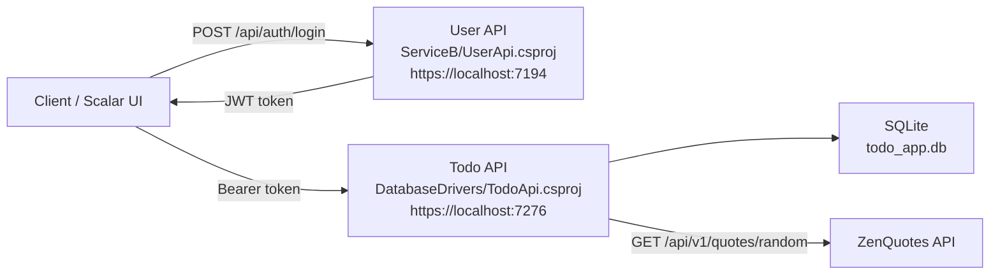

# DatabaseDrivers

[](https://github.com/RoffeRuff42/DatabaseDrivers/actions/workflows/dotnet.yml)

DatabaseDrivers is a .NET 9 solution with two ASP.NET Core APIs. The main service is a Todo API backed by SQLite, protected with JWT authentication, and documented through Scalar/OpenAPI. A separate User API issues JWT tokens for the demo users used by the Todo API.

## Architecture



The User API is responsible for login and JWT creation. The Todo API validates the JWT and uses the user id claim to scope todo data to the authenticated user. The services currently cooperate through this JWT flow: the client logs in through the User API, then sends the issued token to the Todo API. The Todo API stores todos in SQLite and calls ZenQuotes through the quote endpoint.

## Projects

| Project | Path | Purpose |
| --- | --- | --- |
| Todo API | `DatabaseDrivers/TodoApi.csproj` | Main API for creating, reading, updating, and deleting todos. Uses SQLite outside tests. |
| User API | `ServiceB/UserApi.csproj` | Authentication API that returns JWT tokens for known demo users. |
| Tests | `TodoApi.Tests/TodoApi.Tests.csproj` | Unit and integration tests for the Todo API. |

## Requirements

- .NET SDK 9
- A terminal such as PowerShell, Windows Terminal, or the Visual Studio Package Manager Console
- Optional: Visual Studio 2022 or Rider for launching multiple projects together

## Configuration

Both `TodoApi` and `UserApi` need the same JWT settings so tokens created by the User API can be accepted by the Todo API.

Use user secrets for local development so real secrets are not committed.

```powershell
dotnet user-secrets set "Jwt:Key" "replace-with-a-long-local-development-secret" --project .\DatabaseDrivers\TodoApi.csproj
dotnet user-secrets set "Jwt:Issuer" "DatabaseDrivers" --project .\DatabaseDrivers\TodoApi.csproj
dotnet user-secrets set "Jwt:Audience" "DatabaseDriversUsers" --project .\DatabaseDrivers\TodoApi.csproj

dotnet user-secrets set "Jwt:Key" "replace-with-a-long-local-development-secret" --project .\ServiceB\UserApi.csproj
dotnet user-secrets set "Jwt:Issuer" "DatabaseDrivers" --project .\ServiceB\UserApi.csproj
dotnet user-secrets set "Jwt:Audience" "DatabaseDriversUsers" --project .\ServiceB\UserApi.csproj
```

The User API also needs at least one configured test user. Add one with user secrets:

```powershell
dotnet user-secrets set "TestUsers:0:UserId" "1" --project .\ServiceB\UserApi.csproj
dotnet user-secrets set "TestUsers:0:Username" "admin" --project .\ServiceB\UserApi.csproj
dotnet user-secrets set "TestUsers:0:Password" "password123" --project .\ServiceB\UserApi.csproj
```

The quote endpoint uses ZenQuotes, which is a public external API and does not need a local API key. Access to the quote endpoint in this application still requires a valid JWT token.

## Restore and Build

From the repository root:

```powershell
dotnet restore .\DatabaseDrivers.sln
dotnet build .\DatabaseDrivers.sln
```

## Run Locally

Start the User API first:

```powershell
dotnet run --project .\ServiceB\UserApi.csproj --launch-profile https
```

The User API listens on:

- `https://localhost:7194`
- `http://localhost:5226`

In a second terminal, start the Todo API:

```powershell
dotnet run --project .\DatabaseDrivers\TodoApi.csproj --launch-profile https
```

The Todo API listens on:

- `https://localhost:7276`
- `http://localhost:5269`

Open the Todo API documentation at:

- `https://localhost:7276/scalar/v1`

Open the User API documentation at:

- `https://localhost:7194/scalar/v1`

## Authentication Flow

The Todo API endpoints are protected with JWT bearer authentication. Log in through the User API, then send the returned token as a bearer token when calling the Todo API.

Example login request:

```http
POST https://localhost:7194/api/auth/login
Content-Type: application/json

{
  "username": "admin",
  "password": "password123"
}
```

The login request must use a user configured under `TestUsers` in the User API configuration. With the setup above, this user is available:

| Username | Password |
| --- | --- |
| admin | `password123` |

Use the returned token like this:

```http
Authorization: Bearer <token>
```

## Todo API Endpoints

Base URL:

```text
https://localhost:7276
```

Main endpoints:

| Method | Endpoint | Description |
| --- | --- | --- |
| `GET` | `/api/v1/todos` | Get todos for the authenticated user. Supports `page`, `pageSize`, and `search`. |
| `GET` | `/api/v2/todos/v2` | Get todos with v2 response data. Supports `page`, `pageSize`, `search`, and `isDone`. |
| `GET` | `/api/v1/todos/{id}` | Get one todo by id. |
| `POST` | `/api/v1/todos` | Create a todo. |
| `PUT` | `/api/v1/todos/{id}` | Update a todo. |
| `DELETE` | `/api/v1/todos/{id}` | Delete a todo. |
| `GET` | `/api/v1/quotes/random` | Get a random quote from the external quote service. |

All endpoints in this table require the JWT bearer token.

## External API Integration

The Todo API integrates with the public ZenQuotes API through `QuoteService`. It is registered as a typed HTTP client with `IHttpClientFactory` and uses a resilience handler for retries.

ZenQuotes itself does not require an API key, so there are no external API secrets to configure for this integration. The application protects access to the integration by requiring JWT authentication on `GET /api/v1/quotes/random`.

Create todo body:

```json
{
  "title": "Buy milk"
}
```

Update todo body:

```json
{
  "title": "Buy oat milk",
  "isDone": true
}
```

## Database

The Todo API uses SQLite in normal local development:

```text
DatabaseDrivers/todo_app.db
```

On startup, the app calls `EnsureCreated()` when it is not running in the `Testing` environment, so the local database is created automatically if it does not already exist.

The test project uses the EF Core in-memory database instead of SQLite.

## Running Tests

Run all tests:

```powershell
dotnet test .\TodoApi.Tests\TodoApi.Tests.csproj
```

The test suite contains:

- Unit tests for `TodoService`
- Integration tests using `WebApplicationFactory`
- Fake authentication for protected Todo endpoints

## CI/CD

The GitHub Actions pipeline is linked from the status badge at the top of this README:

[GitHub Actions: .NET](https://github.com/RoffeRuff42/DatabaseDrivers/actions/workflows/dotnet.yml)

## Notes

- `ServiceB` is the User API even though the folder name is not descriptive.
- The Todo API project is stored in the `DatabaseDrivers` folder and builds as `TodoApi`.
- JWT configuration must match between `TodoApi` and `UserApi`.
- Todo data is scoped by the authenticated user id from the JWT `NameIdentifier` claim.
- The active service-to-service relationship is the JWT-based authentication flow: `UserApi` issues the token and `TodoApi` validates and uses it.
- `ServiceC` and `ServiceShared` exist in the repository, but they are not part of the active `DatabaseDrivers.sln` setup.
