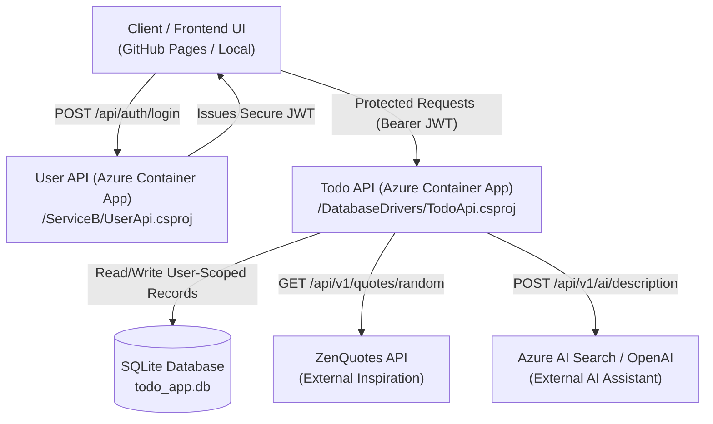

# DatabaseDrivers (Backend Core)

**DatabaseDrivers** is a resilient, production-ready backend solution built with .NET 9. The ecosystem consists of containerized microservices engineered to provide decoupled authentication and business logic. 

The primary domain services are deployed as serverless microservices inside **Azure Container Apps (ACA)** and communicate with the frontend client to power a complete fullstack Todo application featuring automated AI descriptions and resilience-backed third-party integrations.

* **Frontend Repository:** [WebbWizards Frontend](https://github.com/Grahnnen/WebbWizards)

---

## Architectural Overview

```mermaid
graph TD
    Client["Client / Frontend UI<br/>(GitHub Pages / Local)"]
    UserApi["User API (Azure Container App)<br/>/ServiceB/UserApi.csproj"]
    TodoApi["Todo API (Azure Container App)<br/>/DatabaseDrivers/TodoApi.csproj"]
    SQLite[("SQLite Database<br/>todo_app.db")]
    ZenQuotes["ZenQuotes API<br/>(External Inspiration)"]
    AzureAI["Azure AI Search / OpenAI<br/>(External AI Assistant)"]

    Client -->|"POST /api/auth/login"| UserApi
    UserApi -->|"Issues Secure JWT"| Client
    Client -->|"Protected Requests (Bearer JWT)"| TodoApi
    
    TodoApi -->|"Read/Write User-Scoped Records"| SQLite
    TodoApi -->|"GET /api/v1/quotes/random"| ZenQuotes
    TodoApi -->|"POST /api/v1/ai/description"| AzureAI
```
### Component Breakdown & Token Economy
* Decoupled Identity Management (UserApi): Responsible exclusively for user verification and cryptographic token generation. It validates incoming credentials against configured data profiles and mints an isolated JSON Web Token (JWT).
* Domain Context & Resource Validation (TodoApi): Validates incoming Bearer JWT signatures against shared parameters. Once verified, it extracts the unique NameIdentifier claim to scope all database operations (SELECT, INSERT, UPDATE, DELETE) exclusively to the authenticated user context.
* Service Interoperability: Microservices are entirely stateless. The ecosystem scales out fluidly because state context is securely transported by the client inside the authorization header on every cycle.

### Repository Projects & Layout
Project Namespace,Physical Directory Path,Architectural Purpose
Todo API,DatabaseDrivers/TodoApi.csproj,"Handles domain business logic, AI completion mapping, and SQLite transactions."
User API,ServiceB/UserApi.csproj,Identity server generating valid JWT signatures for pre-seeded test configurations.
Tests,TodoApi.Tests/TodoApi.Tests.csproj,Unit and integration suites checking services via WebApplicationFactory.

[!NOTE]ServiceC and ServiceShared exist as legacy/experimental assets inside the file tree but are excluded from the active compiler pipeline (DatabaseDrivers.sln).

### Environment & Deployment Configurations
We maintain two functional runtime tiers. Environment variables are carefully separated to adapt service parameters between decoupled local files and enterprise cloud resources:
Operational FeatureLocal Environment (Development)Production Tier (Production - Azure)Frontend Channelhttp://localhost:5500 (Live Server)Deployed via GitHub PagesTodo Service Hosthttps://localhost:7276app-todo-api-innovators.[...].azurecontainerapps.ioUser Service Hosthttps://localhost:7194app-user-api-innovators.[...].azurecontainerapps.ioPersistence EngineSQLite (Local physical file todo_app.db)SQLite (Persistent Volume Mount inside Azure Container App)Secret ManagementLocal developer User Secrets (secrets.json)Enclosed in Azure Key Vault (kv-innovators)Access ControlLocal configuration blocksSystem-assigned Managed Identity (Azure RBAC)CI/CD PipelineManual triggers via IDE / local terminalAutomated GitHub Actions on push to mainEnterprise Security & Cloud InfrastructureProduction Secrets IsolationIn production, cleartext application settings are strictly forbidden. The applications load configuration parameters securely at runtime from Azure Key Vault (kv-innovators).Naming Conventions: .NET configuration providers map hierarchy depths by looking for matching environment variables. Key Vault handles structural depth using double hyphens (--), which the application resolves into standard double underscores (__) at runtime.Example mapping: Key Vault Secret TestUsers--0--Password automatically binds to TestUsers:0:Password in C#.Principle of Least Privilege (RBAC)Instead of distributing static account connection tokens, our microservices leverage passwordless System-assigned Managed Identities:When a Container App is provisioned, Azure active directory automatically creates an identity profile for that specific resource.Under Azure Identity Access Management (IAM), these specific container profiles are granted the strict Key Vault Secrets User role.Access rights are defined exclusively at the Resource-level scope (directly on the kv-innovators resource), preventing lateral privilege escalation across the wider resource group or subscription.Serverless Infrastructure (Scale to 0)To maximize computing efficiency and eradicate idle architecture billing, both Container Apps employ serverless scaling definitions:Scale to 0: When traffic hits zero, container nodes spin down completely.Cold Starts: The initial request sent to a sleeping container triggers an automated infrastructure cold boot (approx. 5-15 seconds). The .NET runtime optimizes compilation pipelines to ensure the microservice is responsive instantly after initialization.JWT State Retention: Because encryption validations rely on persistent configurations inside the Key Vault rather than volatile in-memory cache, container nodes can scale down to zero or restart without invalidating or logging out active client sessions.Local Development Setup1. Cryptographic Initialization (User Secrets)To build and execute locally, matching JWT authorization constraints must be injected into your machine's local encrypted secret store. Run the following snippets from the solution root:PowerShell# Inject validation constraints into the Todo API
dotnet user-secrets set "Jwt:Key" "replace-with-a-long-local-development-secret-key-32-bytes" --project .\DatabaseDrivers\TodoApi.csproj
dotnet user-secrets set "Jwt:Issuer" "DatabaseDrivers" --project .\DatabaseDrivers\TodoApi.csproj
dotnet user-secrets set "Jwt:Audience" "DatabaseDriversUsers" --project .\DatabaseDrivers\TodoApi.csproj

# Inject matching authentication configurations into the User API
dotnet user-secrets set "Jwt:Key" "replace-with-a-long-local-development-secret-key-32-bytes" --project .\ServiceB\UserApi.csproj
dotnet user-secrets set "Jwt:Issuer" "DatabaseDrivers" --project .\ServiceB\UserApi.csproj
dotnet user-secrets set "Jwt:Audience" "DatabaseDriversUsers" --project .\ServiceB\UserApi.csproj

# Seed local administrator profile parameters
dotnet user-secrets set "TestUsers:0:UserId" "1" --project .\ServiceB\UserApi.csproj
dotnet user-secrets set "TestUsers:0:Username" "admin" --project .\ServiceB\UserApi.csproj
dotnet user-secrets set "TestUsers:0:Password" "password123" --project .\ServiceB\UserApi.csproj
2. Compile and Restore AssetsPowerShelldotnet restore .\DatabaseDrivers.sln
dotnet build .\DatabaseDrivers.sln
3. Local ExecutionSpin up the Identity engine first:PowerShelldotnet run --project .\ServiceB\UserApi.csproj --launch-profile https
In a separate shell terminal, start the core Todo resource engine:PowerShelldotnet run --project .\DatabaseDrivers\TodoApi.csproj --launch-profile https
Local API Interactive DocumentationOnce active, interactive endpoints testing frameworks can be reviewed directly via the built-in OpenAPI Scalar engines:User Identity Dashboard: https://localhost:7194/scalar/v1Todo Application Operations: https://localhost:7276/scalar/v1Core API Contracts (Endpoints)All core application endpoints demand a valid cryptographically signed JWT token sent inside the Authorization header: Authorization: Bearer <token>.Authentication Provider (User API)POST /api/auth/login - Accepts user payload (username/password). Validates criteria and responds with an expiration stamp and JWT token.Todo Engine (Todo API)MethodURI Endpoint PathData Scope & ActionsGET/api/v1/todosRetrieves standard active payload index mapped to active user id.GET/api/v2/todos/v2Advanced pagination contract supporting precise filters (isDone, search).GET/api/v1/todos/{id}Returns a single todo document if owned by the requesting identity.POST/api/v1/todosCreates and stores a fresh user-scoped todo entry.PUT/api/v1/todos/{id}Modifies titles or flags status transformations.DELETE/api/v1/todos/{id}Purges specific entity from persistence tier.GET/api/v1/quotes/randomRelays proxy authentication to surface third-party ZenQuotes.POST/api/v1/ai/descriptionProcesses active context to stream down AI todo structural descriptions.Storage & Reliability SystemsDevelopment DB Handling: Local cycles run over a file-based SQLite database layer located at DatabaseDrivers/todo_app.db. On launch, unless a dedicated test pipeline is detected, the engine executes EnsureCreated() to construct local constraints and metadata abstractions dynamically if absent.Testing Resilience: Automated verification loops replace disk-reliant SQLite links with volatile, high-speed EF Core In-Memory Database components to guarantee clean state baselines between checks.HTTP Client Resilience: External API footprints (ZenQuotes) are processed through an explicit IHttpClientFactory pattern paired with structured resilience handlers (automated retry back-offs) to absorb transient internet dropped-packet events.Automated Test ExecutionThe test matrix covers business layers and controller contracts using isolated assertion logic.PowerShelldotnet test .\TodoApi.Tests\TodoApi.Tests.csproj
The pipeline covers structural unit validation blocks, authentication overrides via custom WebApplicationFactory overrides, and functional service boundary assertions.Runbook Light (Operations Manual)1. Critical Upstream DependenciesLocal/Cloud File Access (SQLite DB): If storage accessibility locks up, endpoints respond with an immediate HTTP 500 Internal Server Error.Azure Key Vault: Crucial during initialization. Security connection errors crash the microservice lifecycle on initialization.AI Completion APIs: Intermittent loss of external tokens flags local failures gracefully inside the console log; core CRUD database endpoints continue running.2. Live Cloud Observability & TelemetryOperational auditing and production error traces are piped centrally into our Azure monitoring infrastructure:Distributed Metrics: Aggregated in real-time within Azure Application Insights (appi-innovators-prod).Console Outputs: Raw runtime logging is piped directly to our Log Analytics Workspace (law-student-logs).Inspecting Container Performance & System Errors via KQLTo audit application crashes, HTTP error profiles, or startup initialization blocks, run the following KQL (Kusto Query Language) query inside your Azure Portal logs console:KodavsnittContainerAppConsoleLogs_CL
| where ContainerAppName_s in ("app-todo-api-innovators", "app-user-api-innovators")
| where ContainerImage_s notcontains "nginx"
| order by TimeGenerated desc
| take 50
Expand individual response dictionaries and look into the Log_s property to isolate exact .NET exception stack traces.3. Incident Troubleshooting MatrixDeployment Crash / Application Offline: Check Azure Container App replica status. Verify that the KEYVAULT_URL environment parameter points exactly to your Key Vault URI endpoint, and check that the container's System Identity retains the required role assignments.CORS Block / Network Error: Check the client web browser console. Verify that the dynamic initialization configurations (env.js) generated by the deployment workflow mirror actual production backend URLs exactly.Runtime 403 Forbidden Errors: Confirm that token issuer and audience settings match perfectly across both operational applications.4. Emergency Infrastructure Rollback PlanNavigate to the GitHub Actions workflow interface.Select the last known-stable compilation artifact from the build history.Select Re-run jobs to push the stable application layer to production.Keep the Log Analytics KQL interface open for 10–15 minutes post-deployment to verify successful initialization and check for HTTP 500 or HTTP 403 regressions.
